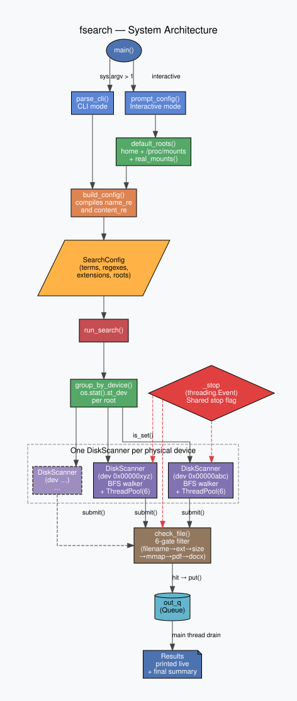
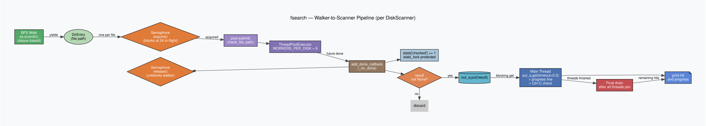
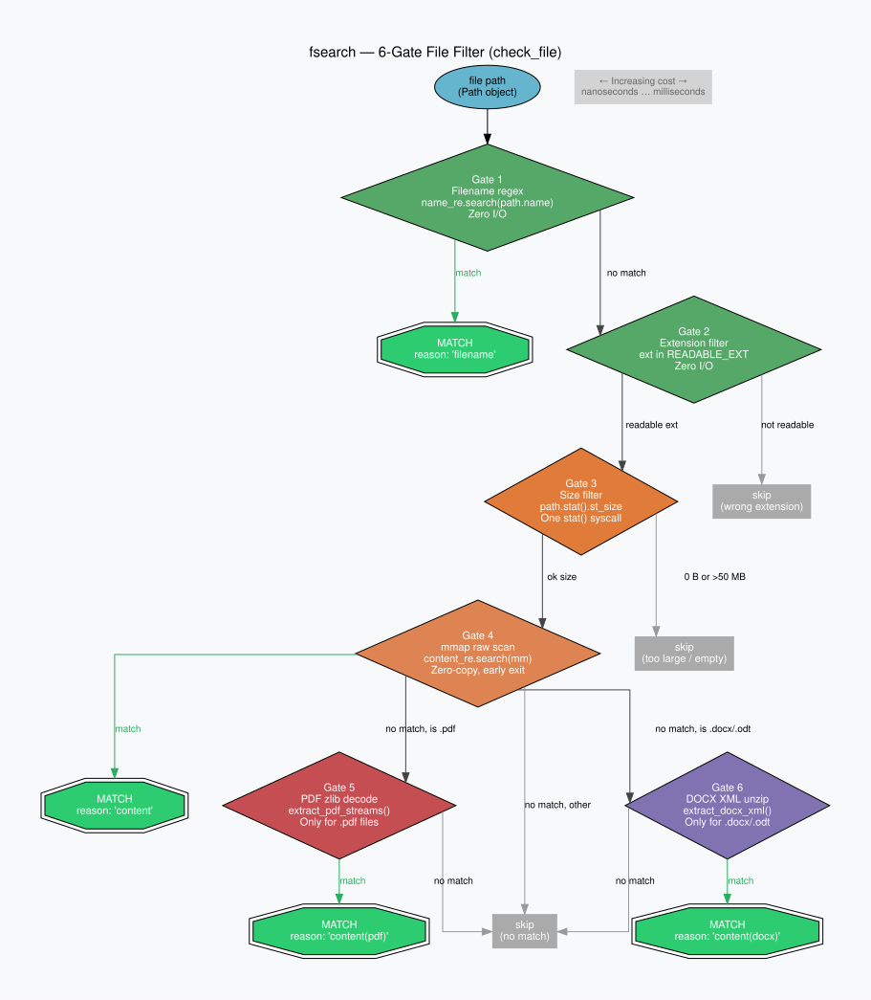
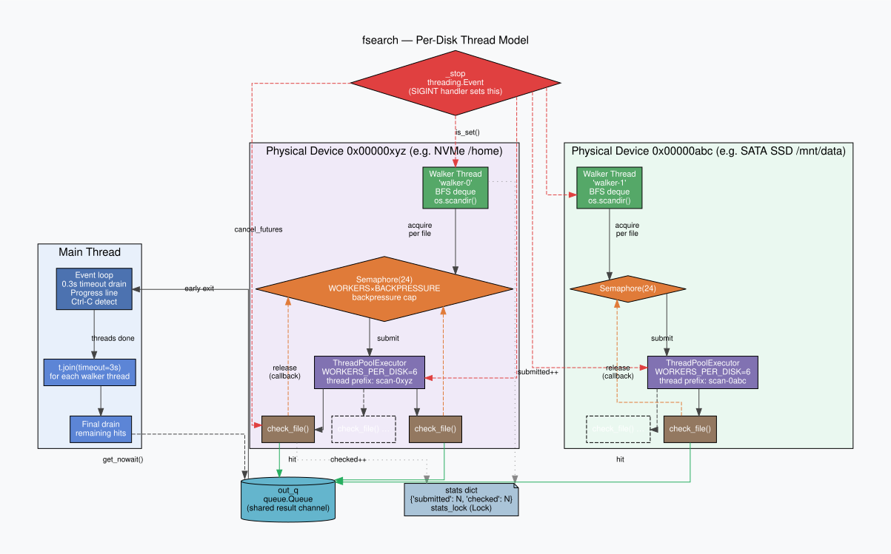

# fsearch — Fast Multi-Disk File Search

`Fsearchv2.py` is a production-grade, general-purpose recursive file search tool written in pure Python (stdlib only). It searches filenames **and** file contents in parallel across multiple physical disks, reporting hits immediately as they are found.

---

## Project Files

| File | Description |
|------|-------------|
| `Fsearchv2.py` | **Main tool** — BFS walk, mmap content scan, per-disk thread pools, backpressure, graceful Ctrl-C |
| `Fsearch.py` | Original DFS/substring variant (pre-mmap, pre-BFS) |
| `scribd_downloader.py` | Async Playwright PDF downloader for Scribd documents |
| `find_adams_phase.py` | Specialised finder (v1) — single pool, naive walk |
| `find_adams_phasev2.py` | Specialised finder (v2) — per-disk pools, queue pipeline |
| `find_adams_phasev3.py` | Specialised finder (v3) — signal handling, DFS, `st_dev` checks |
| `find_adams_phasev4.py` | Specialised finder (v4) — callback-based futures, drain loop |

---

## Usage

### Interactive mode

```bash
python3 Fsearchv2.py
```

Prompts for search terms, file types, case sensitivity, and paths.

### CLI mode

```bash
# Search for "rule of phase" in all readable files under home + mounted drives
python3 Fsearchv2.py -t "rule of phase"

# Restrict to PDF and DOCX, search /home and a NAS mount
python3 Fsearchv2.py -t "Q3 budget" -e pdf docx -p /home /mnt/nas

# Case-sensitive search
python3 Fsearchv2.py -t secret -c

# Multiple terms (any match)
python3 Fsearchv2.py -t "Adams" "Rule of Phase" "Ethereal Phase"
```

### Arguments

| Flag | Long | Description |
|------|------|-------------|
| `-t` | `--terms` | One or more search terms (required) |
| `-p` | `--paths` | Root paths to search (default: home + real mounts) |
| `-e` | `--ext` | File extensions to scan (default: all readable types) |
| `-c` | `--case` | Case-sensitive matching (default: case-insensitive) |

---

## Architecture

The tool is structured around three independent concerns: **root detection**, **per-disk scanning**, and **result reporting**. These run concurrently so hits appear the instant they are found.



### Key constants

| Constant | Value | Meaning |
|----------|-------|---------|
| `WORKERS_PER_DISK` | 6 | Scanner threads per physical device |
| `BACKPRESSURE_MULT` | 4 | Semaphore cap = workers × this (24 in-flight futures/disk) |
| `MAX_FILE_MB` | 50 | Files larger than this are skipped |
| `SHUTDOWN_TIMEOUT` | 3.0 s | Grace period for worker threads on Ctrl-C |

---

## Pipeline

Walking and scanning run as a **concurrent pipeline**: the BFS walker submits files to a thread pool the moment they are discovered. Results are reported via callback as each scan completes — not after the entire tree has been walked.



The semaphore limits in-flight futures to `WORKERS_PER_DISK × BACKPRESSURE_MULT = 24` per disk, preventing the walker from flooding the queue on fast storage.

---

## File Check Gates

Every file passes through up to six gates, ordered from cheapest to most expensive. Most files are eliminated at Gate 1 or 2 with zero I/O.



| Gate | Operation | Cost |
|------|-----------|------|
| 1 | Filename regex (`name_re.search(path.name)`) | Nanoseconds — zero I/O |
| 2 | Extension filter (`ext in READABLE_EXT`) | Nanoseconds — zero I/O |
| 3 | Size filter (`path.stat().st_size`) | One `stat()` syscall |
| 4 | mmap raw scan (`content_re.search(mm)`) | One `open()` + zero-copy regex with early exit |
| 5 | PDF zlib decode (`extract_pdf_streams()`) | CPU decompression — only reached by PDFs past gate 4 |
| 6 | DOCX ZIP unpack (`extract_docx_xml()`) | ZIP extraction — only reached by `.docx`/`.odt` past gate 4 |

### Readable file types (default)

`.txt` `.md` `.rst` `.html` `.htm` `.xml` `.pdf` `.epub` `.djvu` `.docx` `.odt` `.rtf` `.tex` `.csv` `.log`

### Skipped directories (always)

`.git` `node_modules` `__pycache__` `.Trash` `lost+found` `System Volume Information` `$Recycle.Bin` `Windows` `proc` `sys` `dev` `run`

---

## Thread Model

One `DiskScanner` is created per physical device (identified by `os.stat().st_dev`). Each scanner has its own BFS walker thread, its own `ThreadPoolExecutor`, and its own backpressure semaphore. All scanners share a single `out_q` result channel and the global `_stop` event.



This architecture ensures that I/O-bound work on one disk never blocks workers on another disk. A single global thread pool would create contention across devices.

---

## Graceful Shutdown

`SIGINT` (Ctrl-C) sets `_stop` (a `threading.Event`). Every long-running loop checks `_stop.is_set()`. On shutdown, each pool calls `shutdown(wait=False, cancel_futures=True)` (Python 3.9+), cancelling queued-but-not-started futures immediately. The process exits within `SHUTDOWN_TIMEOUT` seconds regardless of how many files are in flight.

---

## Progress Output

```
==============================================================
  fsearch  —  14:23:07
  Disks   : 2
    0x00000801  →  /home/jeb
    0x00000802  →  /mnt/data
  Workers : 6/disk  (12 total)  · backpressure cap 24/disk
==============================================================

  ✓  [filename      ]  /home/jeb/docs/adams-phase.pdf
  ✓  [content(pdf)  ]  /mnt/data/archive/history_vol2.pdf
  …  12,483 scanned  /  31,920 queued  /  2 hits  [4,161/s]

==============================================================
  Done        14:23:14
  Queued  :      31,920
  Scanned :      31,920  (4,161 files/s)
  Matches :           2
==============================================================
```

The dual counter (`scanned / queued`) reveals whether the bottleneck is the walker or the scanners. If queued races far ahead of scanned, the scanners are saturated (healthy). If they track together and grow slowly, the walker is the bottleneck (I/O-limited directory listing).

---

## Lessons Learned: Building Performant Filesystem Search from First Principles

*Derived from iteratively building a multi-disk recursive file search tool in Python.*

---

### The Problem Statement

Find a specific file (or files matching content signatures) across multiple large
disks as fast as possible, report hits immediately, and handle interruption cleanly.
Sounds simple. The naive implementation is 10x–100x slower than it needs to be,
and the bugs in the naive version are non-obvious until you understand the underlying
hardware model.

---

### Lesson 1: Identify the Real Bottleneck Before Writing Code

The first instinct when a search is slow is "add more threads." This is almost
always wrong until you know *what kind* of bottleneck you have.

There are three distinct bottleneck types:

| Bottleneck | Symptom | Fix |
|---|---|---|
| **CPU-bound** | One core pegged at 100%, others idle | More threads / multiprocessing |
| **Single-disk I/O-bound** | Disk at 100% throughput, CPU idle | Fewer threads (reduce seek contention) |
| **Multi-disk I/O-bound** | One disk saturated, others idle | Per-disk thread pools |

Filesystem search is almost always **I/O-bound**. Adding threads beyond the disk's
queue depth doesn't help — it just creates thread contention on the same hardware
queue. The correct abstraction is: *one independent thread pool per physical device.*

**Rule of thumb:** profile before tuning. `iostat -x 1` will show you which disks
are saturated and which are idle. If only one disk is busy, adding workers does nothing.

---

### Lesson 2: Identify Physical Devices, Not Logical Paths

Mount points and directory paths are logical constructs. Two paths can look
completely different (`/home/user` and `/mnt/backup`) but live on the same
physical spindle, sharing one I/O queue. Parallelising across them wastes threads.

Python exposes the physical device ID via `os.stat(path).st_dev`. Paths with the
same `st_dev` share a device and should share a pool.

```python
from collections import defaultdict
import os

def group_roots_by_device(roots):
    groups = defaultdict(list)
    for root in roots:
        try:
            groups[os.stat(root).st_dev].append(root)
        except OSError:
            pass
    return groups  # {device_id: [path1, path2, ...]}
```

This automatically handles RAID arrays (appear as one device), network mounts,
USB drives, and NVMe namespaces — without any special-casing.

---

### Lesson 3: Filter Mount Points Before Walking

A common trap: `/mnt/` is full of empty directories that serve as mount points.
When nothing is mounted there, they all share the root filesystem's `st_dev`.
Naively passing them all as roots gives you one pool with 40+ paths, all of which
are empty directories — wasted scanning and a misleading device count.

The fix is to only include paths that are *actually mounted*:

```python
def real_mounts() -> set[Path]:
    mounts = set()
    with open('/proc/mounts') as f:
        for line in f:
            parts = line.split()
            if len(parts) >= 2:
                mounts.add(Path(parts[1]))
    return mounts

def is_real_mountpoint(p: Path) -> bool:
    # A real mount always has a different st_dev from its parent
    try:
        return os.stat(p).st_dev != os.stat(p.parent).st_dev
    except OSError:
        return False
```

Use `/proc/mounts` as the primary source (Linux), with `st_dev != parent.st_dev`
as a portable fallback.

---

### Lesson 4: Decouple Walking from Scanning (Pipeline Architecture)

The naive pattern is:

```
Phase 1: walk entire tree → collect list of all files
Phase 2: scan all files → report results
```

This is wasteful in two ways:
- Results appear only after the *entire* tree is walked, which can take minutes
- The scanner sits idle during the walk; the walker sits idle during the scan

The correct pattern is a **pipeline**: walk and scan run concurrently, with
results reported as they arrive.

```
walk discovers file → submit to thread pool immediately
                              ↓
                        worker scans file → callback fires → hit reported
```

In Python, `ThreadPoolExecutor` with `add_done_callback` implements this cleanly.
The callback fires in the worker thread the instant `check_file()` returns — not
after the walk finishes, not after a drain loop:

```python
def run(self):
    def on_done(future):
        stats['checked'] += 1
        result = future.result()
        if result:
            out_q.put(result)

    for path in self._walk(root):
        future = pool.submit(check_file, path)
        future.add_done_callback(on_done)   # fires immediately on completion

    pool.shutdown(wait=True)   # wait for tail-end futures after walk finishes
```

`pool.shutdown(wait=True)` at the end is still needed to catch the last few files
submitted near the end of the walk that haven't finished scanning yet — but by then
the vast majority of results have already been reported.

---

### Lesson 5: Order Checks by Cost — Cheapest First

Every file goes through a pipeline of checks. Ordering them from cheapest to most
expensive means most files are eliminated early at zero cost:

```
1. Filename match     — zero I/O, regex on a string already in memory
2. Extension filter   — skip non-readable types (no read needed)
3. Size filter        — skip huge/empty files (one stat() call)
4. Raw bytes scan     — read file, search bytes as-is (no decompression)
5. PDF stream decode  — only if raw scan missed AND file is a PDF
6. DOCX XML unzip     — only if raw scan missed AND file is a DOCX
```

The expensive operations (zlib decompression, ZIP extraction) are only reached
by files that pass all cheaper gates. For a 50,000-file corpus where only 1%
are PDFs and the target content is rare, this avoids decompressing ~99.9% of files.

```python
def check_file(path):
    # Gate 1: free
    if NAME_RE.search(path.name):
        return (path, 'FILENAME')

    # Gate 2: free
    if path.suffix.lower() not in READABLE_EXT:
        return None

    # Gate 3: one syscall
    size = path.stat().st_size
    if size == 0 or size > MAX_FILE_MB * 1_048_576:
        return None

    # Gate 4: one read, no decompression
    raw = path.read_bytes()
    if any(sig in raw for sig in CONTENT_SIGS):
        return (path, 'CONTENT')

    # Gate 5: expensive — only for PDFs that passed gate 4
    if path.suffix.lower() == '.pdf':
        streams = decompress_pdf_streams(raw)
        if any(sig in streams for sig in CONTENT_SIGS):
            return (path, 'CONTENT(pdf)')

    return None
```

---

### Lesson 6: Use Iterative Tree Walking, Not Recursive

Recursive `os.walk` or a recursive `_walk()` method blows the Python call stack
on deeply nested directories (the default limit is 1000 frames). It also makes
graceful cancellation harder, since you'd need to propagate a stop signal through
the call stack.

An iterative DFS with an explicit stack solves both:

```python
def walk(root, device_id, stop_event):
    stack = [root]
    while stack and not stop_event.is_set():
        current = stack.pop()
        try:
            with os.scandir(current) as it:
                for entry in it:
                    if stop_event.is_set():
                        return
                    if entry.is_dir(follow_symlinks=False):
                        if entry.name in SKIP_DIRS:
                            continue
                        # Stay on same physical device
                        if os.stat(entry.path).st_dev != device_id:
                            continue
                        stack.append(Path(entry.path))
                    elif entry.is_file(follow_symlinks=False):
                        yield Path(entry.path)
        except (PermissionError, OSError):
            continue
```

The `stop_event.is_set()` check on every iteration means Ctrl-C propagates
within milliseconds rather than waiting for the current subtree to finish.

Use `os.scandir()` as a context manager (the `with` form) — it ensures the
directory handle is closed immediately rather than waiting for GC, which matters
when scanning tens of thousands of directories.

---

### Lesson 7: Graceful Shutdown Requires Coordinated Stop Signalling

The naive approach to Ctrl-C — letting the `KeyboardInterrupt` propagate — leaves
daemon threads mid-flight, causing `RuntimeError: cannot schedule new futures after
interpreter shutdown` as the pool is torn down while walkers are still submitting.

The correct approach uses a `threading.Event` as a shared stop flag, set by a
`signal.SIGINT` handler:

```python
_stop = threading.Event()

def _sigint_handler(sig, frame):
    print('\nStopping…')
    _stop.set()

signal.signal(signal.SIGINT, _sigint_handler)
```

Every long-running loop checks `_stop.is_set()`. On shutdown, call
`pool.shutdown(wait=False, cancel_futures=True)` (Python 3.9+) rather than
`wait=True` — this cancels queued-but-not-started futures immediately:

```python
try:
    for path in walk(root, device_id, _stop):
        if _stop.is_set():
            break
        pool.submit(check_file, path).add_done_callback(on_done)
finally:
    pool.shutdown(
        wait=not _stop.is_set(),       # wait normally; don't wait on Ctrl-C
        cancel_futures=_stop.is_set()  # cancel queued futures on Ctrl-C
    )
```

This ensures the process exits cleanly within a second of Ctrl-C regardless of
how many files are in flight.

---

### Lesson 8: Separate "Submitted" from "Checked" in Progress Reporting

A common mistake is showing a single counter that conflates "files found by walker"
with "files scanned by workers." These are decoupled in a pipeline architecture —
the walker can race far ahead of the scanners.

Show both:

```
… 12,483 scanned / 31,920 queued / 2 hits
```

This tells you immediately whether the bottleneck is the walker (queued ≈ scanned,
both growing slowly) or the scanners (queued racing ahead of scanned — scanners
are saturated, which is the healthy state). The gap between them is your in-flight
work queue depth.

Progress reporting should happen in the main thread (or a dedicated reporter thread)
and never block the scanners. A simple `time.sleep(0.3)` polling loop draining a
`queue.Queue` works well. Print with `end='\r'` for a live counter, and clear the
line before printing a hit so hits don't get overwritten.

---

### Lesson 9: Device Boundary Detection Prevents Cross-Device Scanning

When walking, always check that subdirectories remain on the same physical device:

```python
if os.stat(entry.path).st_dev != device_id:
    continue
```

Without this, the walker follows bind mounts, NFS mounts, and `tmpfs` overlays,
potentially scanning the same files multiple times or hanging on unresponsive
network mounts. It also defeats the per-device pool architecture entirely.

This is essentially a portable reimplementation of `find -xdev` (do not cross
device boundaries).

---

### Lesson 10: Match the Worker Count to Disk Characteristics

Different storage media have different optimal concurrency:

| Medium | Characteristic | Optimal workers |
|---|---|---|
| **HDD (spinning)** | Sequential reads fast, random seeks expensive | 1–2 per disk |
| **SATA SSD** | High throughput, moderate queue depth | 4–8 per disk |
| **NVMe SSD** | Very deep queue, parallelism beneficial | 8–16 per disk |
| **Network mount** | Latency-bound, many concurrent requests help | 8–32 per disk |
| **RAID array** | Depends on underlying disks | Treat as one disk |

A single constant like `WORKERS_PER_DISK = 4` is a reasonable default but not
optimal for all hardware. The ideal value is found empirically: increase workers
until `iostat` shows the disk saturated — that's your sweet spot. More than that
and you're just adding context-switch overhead.

---

### Lesson 11: Name Pattern Matching Is Orders of Magnitude Cheaper Than Content Scanning

In a corpus of 50,000 files, a filename regex match costs nanoseconds per file.
Reading and scanning file contents costs microseconds to milliseconds. Always try
the filename first.

This seems obvious but is easy to skip when you're focused on the content-search
problem. In practice, a large fraction of "interesting" files have descriptive
names — `adams-phase.pdf`, `rule_of_phase.txt` — and are found in milliseconds
via filename alone, before the content scanner has even warmed up.

---

### Summary: The Mental Model

Think of the search system as a **factory floor**:

- **One conveyor belt per physical disk** (the walker thread per device)
- **Workers at each belt** (the thread pool per device) who inspect items as they
  arrive — not after the belt finishes
- **An inspector** (the main thread progress loop) who reports findings in real time
- **A red stop button** (the `threading.Event`) visible to everyone that halts the
  whole floor cleanly when pressed

The key insight unifying all the lessons above: **hardware topology must be
reflected in the software architecture**. Disks are independent; pools must be
independent. Walking and scanning are independent stages; they must run concurrently.
Cheap checks and expensive checks are independent; the expensive ones must be gated
behind the cheap ones.

Get the architecture right first. The tuning (worker counts, buffer sizes, batch
sizes) is secondary and empirical.

---

### Quick Reference: Anti-Patterns to Avoid

| Anti-pattern | Problem | Fix |
|---|---|---|
| One global thread pool | All disks contend on one queue | One pool per `st_dev` |
| Collect-all-then-scan | Results delayed until walk finishes | `add_done_callback` pipeline |
| Recursive `_walk()` | Stack overflow on deep trees, hard to cancel | Iterative with explicit stack |
| Unconditional PDF decompression | CPU bottleneck on every file | Two-phase: raw scan first |
| Ignoring `st_dev` in subdirs | Crosses device boundaries, re-scans mounts | Check `st_dev` on every dir entry |
| Including unmounted `/mnt/*` dirs | 40+ roots all on same device | Filter via `/proc/mounts` |
| `KeyboardInterrupt` propagation | `RuntimeError` on pool shutdown | `threading.Event` + signal handler |
| Single counter for progress | Hides walker/scanner imbalance | Track `submitted` and `checked` separately |

---

## Development History

| Version | Key change |
|---------|-----------|
| `find_adams_phase.py` | Single pool, naive recursive walk, 28 workers |
| `find_adams_phasev2.py` | Per-disk pools, queue-based pipeline |
| `find_adams_phasev3.py` | Signal handling, iterative DFS, `st_dev` checks |
| `find_adams_phasev4.py` | Callback-based futures, drain loop |
| `Fsearch.py` | General-purpose: DFS walk, substring matching, `read_bytes()` |
| `Fsearchv2.py` | **Current**: BFS walk, compiled regex, mmap zero-copy scan, backpressure semaphore |

---

## Requirements

- Python 3.9+
- Standard library only (no pip installs for `Fsearchv2.py`)
- `playwright` required for `scribd_downloader.py` only: `pip install playwright && playwright install chromium`
